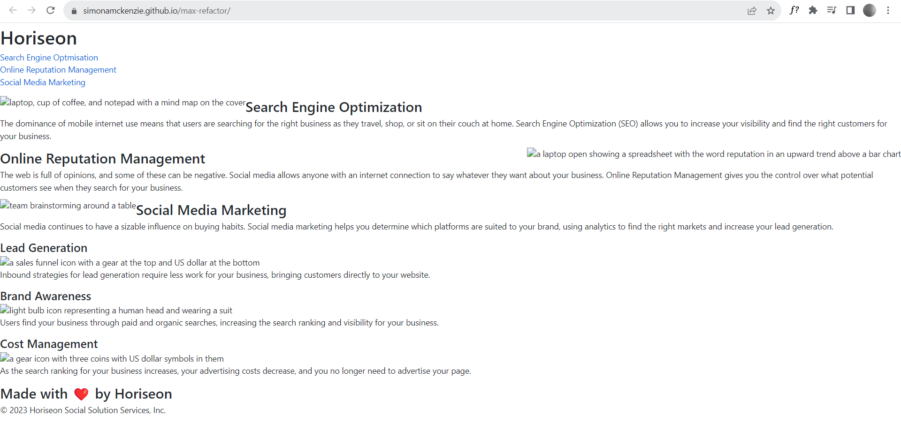
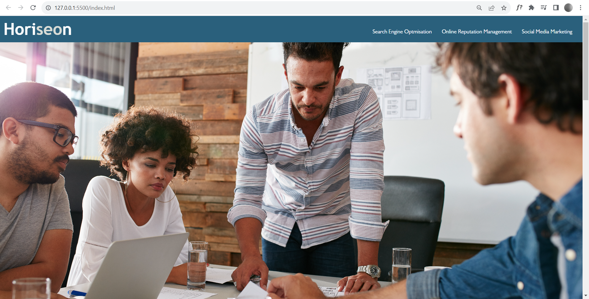
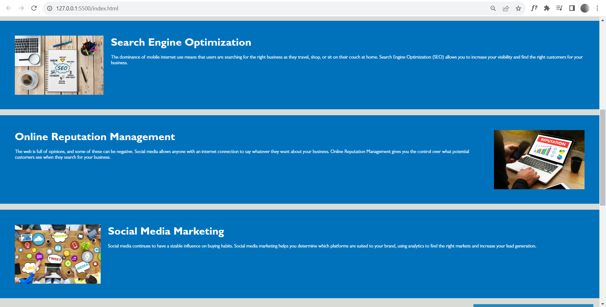
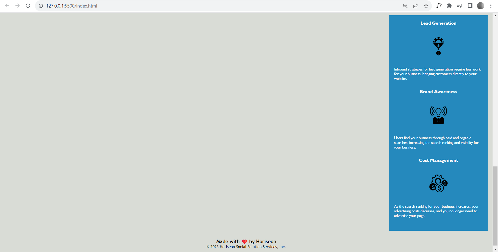

# Max Refactor

## Description 

Overview
This README.md file provides an overview of the Accessibility Refactoring Challenge undertaken for Horiseon Marketing Agency. In this challenge I was tasked with enhancing an existing website to adhere to accessibility standards, to ensure that it is optimised for search engines and accessible to people with disabilities.

Motivation
My motivation was to learn how to refactor html and css so I can make websites accessible to individuals with disabilities to provide equal access, and also implement best practice for search engine optimisation. 

Project Scope
Working with html and css code provided as part of the project, the objective was to satisfy certain requirements for accessibility standards. These requirements included the use of semantic HTML components, the maintenance of a logical structure apart from styling, the inclusion of accessible alt attributes for pictures and icons, the ordering of heading attributes, and the creation of a succinct and informative title element.

Key Features:
- Implementation of semantic HTML elements throughout the source code.
- Logical structuring of HTML elements, ensuring independence from styling and positioning.
- Inclusion of accessible alt attributes for images and icons, enhancing usability for visually impaired users.
- Organization of heading attributes in sequential order, improving content readability and navigation.
- Crafting a concise and descriptive title element, enhancing the website's context and relevance.

Technologies Used 
-Visual Studio Code
-GitBash
-HTML
-CSS

Future Enhancements
While the current challenge focused on meeting specific accessibility criteria, there are several potential areas for 

Future improvement
Interactive Elements - Enhance interactive elements like forms and buttons for keyboard navigation and screen reader compatibility.
Content Expansion - Enrich the website content, making it more informative and engaging for all users.
Visual Design - Improve the visual design to ensure a pleasant user experience for all visitors, regardless of abilities.
Responsive Design - Create a visual experience that adapts to different screen sizes to enhance user experience

Link to Deployed Application
The refactored website is accessible online. You can view the deployed application by following this link: 

https://simonamckenzie.github.io/max-refactor/

This Accessibility Refactoring Challenge not only met the specific requirements outlined in the acceptance criteria but also contributed to the broader goal of creating an inclusive and user-friendly web environment, and also my helped me expand my own understanding on accessibilit in front end web development. By adhering to accessibility standards, the Horiseon Marketing Agency website now provides an enhanced user experience for all visitors, reinforcing its commitment to accessibility and search engine optimization.

## Installation

There are no installation requirments

## Usage 

This a promotional website for a marketing agency called Horiseon and can be used by individuals with specific accesiblity requirements 

## Credits

List of credits:

Created by Simon A McKenzie

W3C Schools webpages - 
https://www.w3schools.com/html/html5_semantic_elements.asp
https://www.w3schools.com/cssref/index.php

Web Accessibility Education - YouTube  
https://www.youtube.com/watch?v=0Y1EEG4GyKU

tutmo - Refactoring for Beginners - YouTube
https://www.youtube.com/watch?v=7yg6JDzWYzM

## License

MIT License

Copyright (c) 2023 Simon A McKenzie

Permission is hereby granted, free of charge, to any person obtaining a copy
of this software and associated documentation files (the "Software"), to deal
in the Software without restriction, including without limitation the rights
to use, copy, modify, merge, publish, distribute, sublicense, and/or sell
copies of the Software, and to permit persons to whom the Software is
furnished to do so, subject to the following conditions:

The above copyright notice and this permission notice shall be included in all
copies or substantial portions of the Software.

THE SOFTWARE IS PROVIDED "AS IS", WITHOUT WARRANTY OF ANY KIND, EXPRESS OR
IMPLIED, INCLUDING BUT NOT LIMITED TO THE WARRANTIES OF MERCHANTABILITY,
FITNESS FOR A PARTICULAR PURPOSE AND NONINFRINGEMENT. IN NO EVENT SHALL THE
AUTHORS OR COPYRIGHT HOLDERS BE LIABLE FOR ANY CLAIM, DAMAGES OR OTHER
LIABILITY, WHETHER IN AN ACTION OF CONTRACT, TORT OR OTHERWISE, ARISING FROM,
OUT OF OR IN CONNECTION WITH THE SOFTWARE OR THE USE OR OTHER DEALINGS IN THE
SOFTWARE.

---

🏆 The sections listed above are the minimum for a good README, but your project will ultimately determine the content of this document. You might also want to consider adding the following sections.

## Tests

Did not require any tests

---

© 2023 edX Boot Camps LLC. Confidential and Proprietary. All Rights Reserved.
